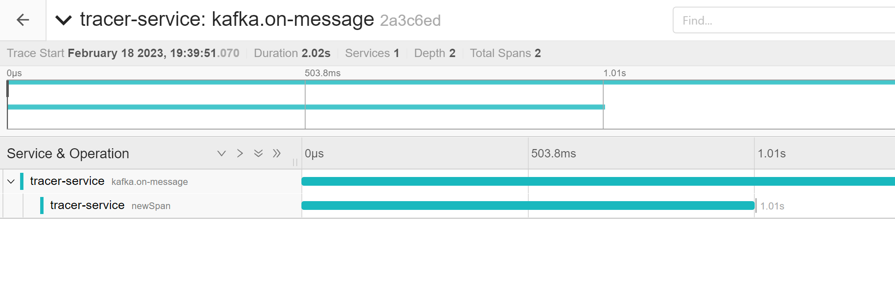
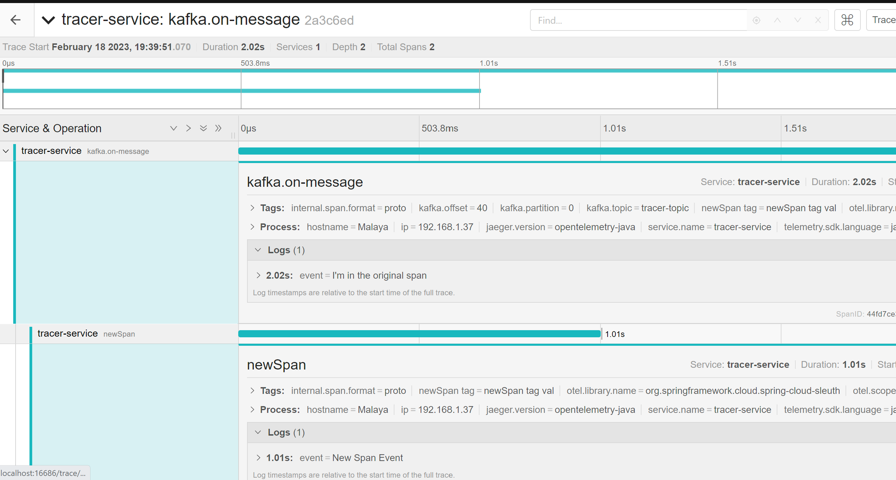
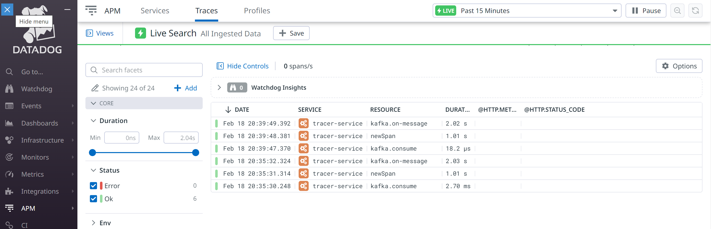

## Terminology

`Span`: The basic unit of work in Distributed Tracing. Anything that happens in a request, is associated with a Span. Multiple spans are linked to each other using Trace.

`Trace`: A set of spans forming a tree-like structure.

`Tag`: Tags are additional information which are stored in Span. These can be queried in a Tracing tool like Jaeger.

## Spring Cloud Sleuth 

### Context Propagation

Traces connect from service to service using header propagation. The default format is B3. To use the provided defaults you can set the spring.sleuth.propagation.type property. 

The value can be a list in which case you will propagate more tracing headers.

### Baggage

Distributed tracing works by propagating fields inside and across services that connect the trace together: `traceId` and `spanId` notably. The context that holds these fields can optionally push other fields that need to be consistent regardless of many services are touched. The simple name for these extra fields is "Baggage".

We can use properties to define fields that have no special configuration such as name mapping:

`spring.sleuth.baggage.remote-fields` is a list of header names to accept and propagate to remote services.

`spring.sleuth.baggage.local-fields` is a list of names to propagate locally

In order to automatically set the baggage values to Slf4j’s MDC, you have to set the `spring.sleuth.baggage.correlation-fields` property with a list of allowed local or remote keys. E.g. `spring.sleuth.baggage.correlation-fields=country-code` will set the value of the country-code baggage into MDC

### Baggage Vs Tags

Like trace IDs, Baggage is attached to messages or requests, usually as headers. Tags are key value pairs sent in a Span to Zipkin. Baggage values are not added spans by default, which means you can’t search based on Baggage unless you opt-in.

To make baggage also tags, use the property `spring.sleuth.baggage.tag-fields`

### Sample Traces

#### Jaeger





#### Datadog




### Example Implementations

1. Using Spring Sleuth, Zipkin, Brave and Jaeger: 
    ```
    implementation 'org.springframework.cloud:spring-cloud-sleuth-zipkin'
    implementation 'org.springframework.cloud:spring-cloud-starter-sleuth'
    implementation 'io.opentracing.brave:brave-opentracing'
    ```
    https://github.com/nayakmk/tracing-jaeger-sleuth-zipkin-k8s

2. Using Spring and Opentelemetry Libraries: 
    ```
     implementation 'io.opentracing:opentracing-api:0.33.0'
     implementation 'io.opentracing.contrib:opentracing-spring-cloud-starter:0.5.9'
     implementation 'io.jaegertracing:jaeger-client:1.8.1'
    ```
    https://github.com/nayakmk/tracing-jaeger-opentelemetry-k8s

3. Using Spring Sleuth and OpenTelemetry and Jaeger using OTLP 
    ```
    implementation('org.springframework.cloud:spring-cloud-starter-sleuth') {
    	exclude group: 'org.springframework.cloud', module: 'spring-cloud-sleuth-brave' //  We want to exclude the default tracer coming from Sleuth...
    }
    implementation 'org.springframework.cloud:spring-cloud-sleuth-otel-autoconfigure'
    implementation 'io.opentelemetry:opentelemetry-exporter-otlp-trace'
    implementation 'io.grpc:grpc-okhttp:1.50.0'
    ```
    https://github.com/nayakmk/tracing-sleuth-jaeger-otel-otlp-kafka-k8s

4. Using Spring Sleuth, OpenTelemetry and Jaeger using Jaeger Collector
    ```
    	implementation('org.springframework.cloud:spring-cloud-starter-sleuth') {
    	exclude group: 'org.springframework.cloud', module: 'spring-cloud-sleuth-brave' //  We want to exclude the default tracer coming from Sleuth...
    }
    implementation 'org.springframework.cloud:spring-cloud-sleuth-otel-autoconfigure'
    implementation "io.opentelemetry:opentelemetry-exporter-jaeger"
    implementation 'io.grpc:grpc-netty:1.53.0'
    ```
    https://github.com/nayakmk/tracing-sleuth-jaeger-otel-kafka-k8s

5. Using Spring Sleuth, OpenTelemetry, and Datadog using OTLP collector

    ```
    	implementation('org.springframework.cloud:spring-cloud-starter-sleuth') {
    		exclude group: 'org.springframework.cloud', module: 'spring-cloud-sleuth-brave'
    	}
    	implementation 'org.springframework.cloud:spring-cloud-sleuth-otel-autoconfigure'
    	implementation 'io.opentelemetry:opentelemetry-exporter-otlp-trace'
    	implementation 'io.grpc:grpc-okhttp:1.50.0'
    ```

    https://github.com/nayakmk/tracing-sleuth-datadog-otel-otlp-kafka-k8s

## Further Reading

1. https://signoz.io/blog/distributed-tracing-span/
2. https://ryanharrison.co.uk/2021/08/06/distributed-tracing-spring-boot-jaeger.html
3. https://docs.spring.io/spring-cloud-sleuth/docs/current-SNAPSHOT/reference/html/project-features.html
4. https://github.com/openzipkin/brave/tree/master/brave#using-baggagefield
5. https://developers.ascendcorp.com/passing-http-headers-to-another-microservice-and-put-them-to-the-log-programmatically-using-spring-91ae60126c6f