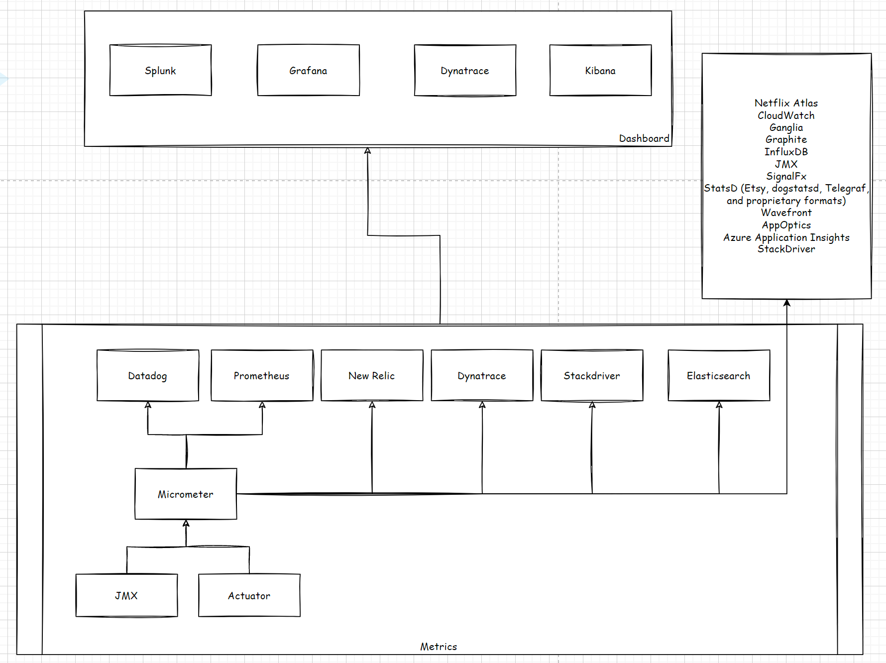

## Concepts

1. Meters: 
2. Timer:   
3. Counter
4. Gauge
5. DistributionSummary
6. LongTaskTimer
7. FunctionCounter
8. FunctionTimer
9. TimeGauge

## How to Implement

`Spring Actuator`: supplies several endpoints in order to monitor and interact with your application.

`Micrometer`: an application metrics facade that supports numerous monitoring systems, Spring Boot Actuator provides support for it.

`Prometheus`: a timeseries database in order to collect the metrics.

`Grafana`: a dashboard for displaying the metrics.

## Example Implementation

This is implemented using Spring Boot application with the help of Spring Actuator, Micrometer, Prometheus and Grafana.

https://github.com/nayakmk/monitoring-prometheus-grafana-k8s

There are lot of metrics aggregation systems which can be integrated and above was an example of that. The complete list of metrics systems and their integration you can find below.

## Further Reading

1. https://rskupnik.github.io/spring-metrics-with-micrometer-and-splunk

2. https://medium.com/@dwijsheth/a-to-z-guide-for-spring-boot-application-monitoring-e93b64722390

3. https://micrometer.io/docs/concepts#_meters
